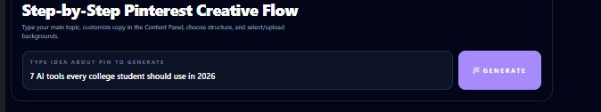
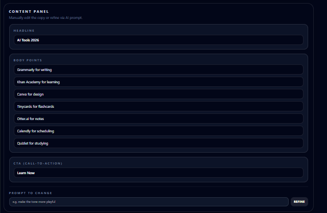
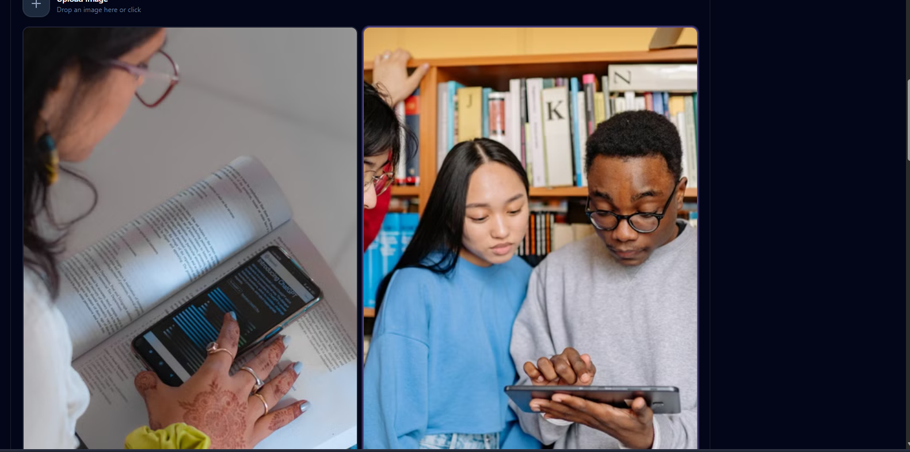
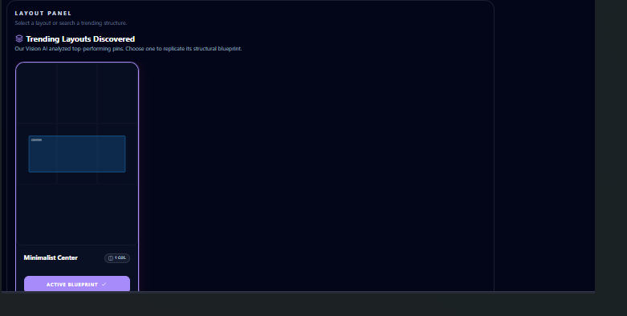
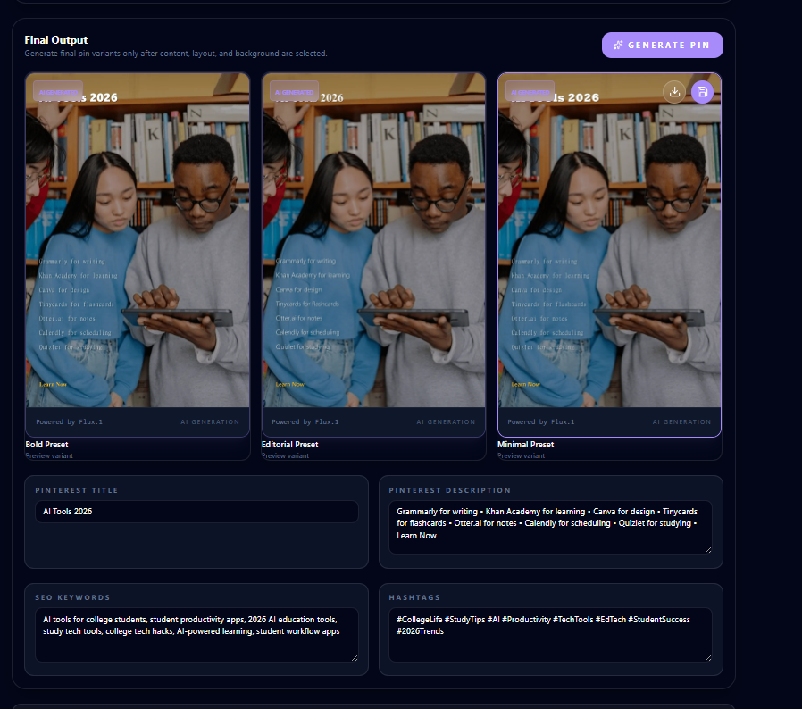

# AI Pinterest Pin Generator

An AI-powered Pinterest content creation platform that automatically transforms a simple topic into Pinterest-ready pins using a multi-agent workflow.

Instead of manually creating content, selecting images, choosing layouts, and writing SEO metadata, the system orchestrates specialized AI agents that generate, validate, and assemble all required components into a final Pinterest pin.

---

# Demo

## Input

User Topic:

```text
7 AI Tools Every College Student Should Use in 2026
```

### Screenshot

```md

```

---

## Generated Content

The Content Agent generates:

* Pinterest headline
* Content points
* Call-to-action

### Screenshot

```md


---

## Generated Backgrounds

The Visual Agent searches and recommends relevant backgrounds.

### Screenshot

```md


---

## Layout Recommendations

The Layout Agent selects Pinterest-friendly layouts.

### Screenshot

```md


---

## Final Generated Pins

Multiple Pinterest-ready variants are generated.

### Screenshot

```md


---

# Architecture

## Workflow

```text
User Topic
    ↓
Content Agent
    ↓
Visual Agent
    ↓
Layout Agent
    ↓
SEO Agent
    ↓
PinProject Assembly
    ↓
Generator Agent
    ↓
Sharp.js Renderer
    ↓
Pinterest Pin Variants
```

---

# Core Features

## Content Generation

Automatically generates:

* Headlines
* Steps / bullet points
* Calls-to-action

Optimized for Pinterest engagement.

---

## Background Discovery

The system:

* Searches relevant visual assets
* Uses AI-generated fallback images
* Stores selected assets in ImageKit

---

## Layout Recommendation

The layout system:

* Matches layouts to content type
* Supports multiple layout candidates
* Allows user refinement and selection

---

## SEO Generation

Automatically generates:

* Pinterest title
* Pinterest description
* Keywords
* Hashtags

---

## Pin Rendering

Selected assets are combined using:

* Background image
* Generated content
* Layout zones

and rendered into final Pinterest pins using Sharp.js.

---

# Tech Stack

## Frontend

* Next.js
* React
* Tailwind CSS
* TypeScript

## Backend

* Next.js API Routes
* Node.js

## Database

* MongoDB
* Mongoose

## Storage

* ImageKit

## AI

* OpenRouter
* GPT-OSS-120B
* Llama Vision Models

## Image Processing

* Sharp.js

---

# Project Structure

```text
src/
├── app/
│   ├── api/
│   │   ├── auth/
│   │   ├── imagekit-auth/
│   │   ├── images/
│   │   └── llm-call/
│   │       ├── create/
│   │       ├── generate-bg/
│   │       ├── generate-content/
│   │       ├── generate-layout/
│   │       ├── generate-pin/
│   │       ├── workflow.ts
│   │       ├── generatePin.ts
│   │       ├── prompts.ts
│   │       ├── toolExecutor.ts
│   │       ├── validation.ts
│   │       └── vision.ts
│   ├── components/
│   ├── create/
│   ├── login/
│   ├── register/
│   ├── globals.css
│   ├── layout.tsx
│   └── page.tsx
│
├── lib/
│   ├── agents/
│   │   ├── content.ts
│   │   ├── critic.ts
│   │   ├── generator.ts
│   │   ├── index.ts
│   │   ├── layout.ts
│   │   ├── planner.ts
│   │   ├── seoagent.ts
│   │   ├── types.ts
│   │   └── visual.ts
│   ├── llm/
│   │   ├── llm.ts
│   │   └── tools/
│   ├── api-client.ts
│   ├── auth.ts
│   ├── db.ts
│   ├── layout-engine.ts
│   ├── sharp-pin-builder.ts
│   └── styles.ts
│
├── models/
│   ├── Image.ts
│   ├── LayoutTemplate.ts
│   └── User.ts
│
└── types/
    ├── hugging-flux.ts
    ├── llm-json.ts
    ├── pexels.ts
    ├── tool.ts
    └── web-tool.ts
```

---

# Current Status

### Implemented

* Multi-agent workflow
* Content generation
* Background recommendation
* Layout recommendation
* SEO generation
* Pin rendering
* ImageKit integration
* Project persistence

### In Progress

* User-specific project ownership
* Improved layout quality
* Better visual ranking
* Deployment optimization

---

# Future Improvements

## Multi-User Architecture

* User-owned projects
* Shared workspaces
* Project permissions

## Better Layout Intelligence

* Layout ranking model
* Trend-aware recommendations
* Pinterest engagement optimization

## Advanced Agent System

* Feedback loops between agents
* Self-evaluation and refinement
* Multi-pass generation

## Analytics

* Pin performance prediction
* SEO scoring
* Engagement estimation

## Batch Generation

Generate multiple Pinterest campaigns from a single topic.

---

# Why This Project?

Pinterest content creation usually requires:

1. Writing content
2. Finding images
3. Designing layouts
4. Optimizing SEO

This project automates the entire workflow through specialized AI agents while still allowing users to refine each stage before final generation.
